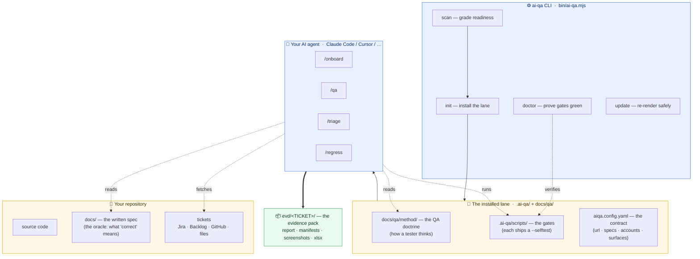
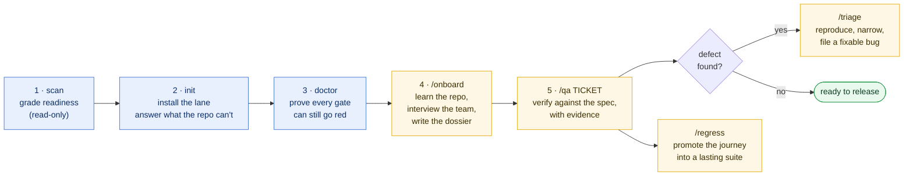
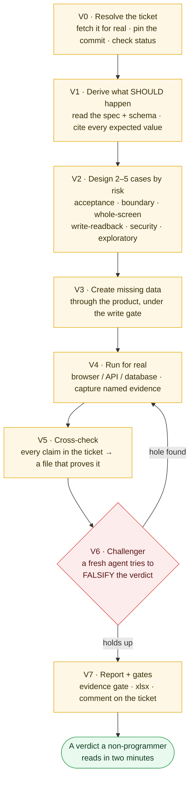
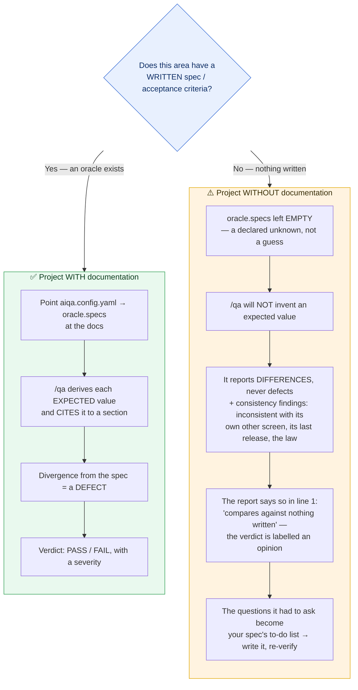

# ai-qa

<p align="center">
  
</p>

**An AI QA engineer you can drop into any codebase.**

It onboards the way a person does — works out what it can, says plainly what it
cannot find, asks the team the rest — and then verifies tickets against the spec
with evidence a non-programmer can read in two minutes.

It reports defects. It never fixes them, and it never invents an expected value.

```bash
npx @connorpham6499/ai-qa scan     # grade this repo: could a QA test it, and would their verdicts mean anything?
npx @connorpham6499/ai-qa init     # install the QA lane (terminal wizard, or --ui for the browser)
npx @connorpham6499/ai-qa doctor   # prove every gate still works — green doctor is the definition of installed
```

The command it installs is `ai-qa`, so once it is a devDependency the scope
drops off: `npx ai-qa scan`. The published name is scoped because npm reserves
the bare `ai-qa` — it is too close to an unrelated `aiqa` package.

Then, inside your agent: `/onboard` · `/qa` · `/triage` · `/regress`.

---

## Contents

- [The problem this exists for](#the-problem-this-exists-for)
- [The whole system at a glance](#the-whole-system-at-a-glance) — the diagram
- [End to end: from an empty repo to a verdict](#end-to-end-from-an-empty-repo-to-a-verdict) — the run, step by step
- [Inside `/qa`: how one ticket is verified](#inside-qa-how-one-ticket-is-verified) — the flowchart
- [With a written spec, and without one](#with-a-written-spec-and-without-one--the-two-paths) — **the two paths** (documented vs undocumented repos)
- [`scan`](#ai-qa-scan--the-mirror-before-you-commit-to-anything) · [`init`](#ai-qa-init--a-setup-that-already-read-your-repo) · [the four workflows](#the-four-workflows)
- [Reading tickets](#reading-tickets--jira-backlog-github-or-files) · [Acceptance criteria](#acceptance-criteria) · [The spreadsheet everyone reads](#the-spreadsheet-everyone-else-reads)
- [Gates that can go red](#gates-that-can-actually-go-red) · [The mind of the tester](#the-mind-of-the-tester) · [Rules the lane will not bend](#rules-the-lane-will-not-bend)
- [Environments](#environments--local--dev--stg--prod) · [Working language](#the-working-language--en--vi) · [Surfaces](#surfaces) · [Agent tools](#agent-tools)
- [Updating safely](#updating-safely) · [Layout](#layout) · [Requirements](#requirements) · [Tests](#tests)

---

## The problem this exists for

Ask an AI agent to test a feature and you get a confident paragraph. Ask what it
actually ran and the answer is usually: it read the code, saw a function that
looked right, and wrote "verified".

The deeper problem is older than AI. **A QA engineer joining a project cannot
test anything until they know what "correct" means here** — and on most teams
that knowledge is not written down. It lives in three people's heads. So the new
tester quietly adopts whatever the code currently does as the expected value,
and from that moment nobody is checking anything.

ai-qa attacks both:

1. **It arrives knowing nothing, and admits it.** `/onboard` tags every line it
   produces as `[OBSERVED]` (with a file citation), `[INFERRED]` (with the
   reasoning shown), `[TOLD BY <who>, <date>]`, or `[UNKNOWN]`. A dossier with no
   UNKNOWNs after a first pass is not thorough — it is fabricated.
2. **It refuses to invent an oracle.** No written spec for an area? Then a
   verification there reports *differences*, never *defects*, and the report says
   so in its first lines. That refusal is the product.

---

## The whole system at a glance

Four moving parts, and one rule connecting them: **nothing is a verdict until a
gate that can go red has passed.** The CLI installs a lane into your repo; your
agent reads the doctrine and drives the product; every claim it makes is checked
by a gate and captured as evidence a stranger can read.



| Part | Lives in | What it is |
|---|---|---|
| **The CLI** | `bin/`, `src/` | `scan` · `init` · `doctor` · `update`. Installs and verifies the lane; never tests your product itself. |
| **The doctrine** | `core/doctrine/` → `docs/qa/method/` | How a real tester thinks — personas, boundaries, security probes, accessibility, how to write a case and a report. The agent reads it at the moment each is needed. |
| **The gates** | `core/scripts/` → `.ai-qa/scripts/` | Small programs that go **red** on a bad verification: missing evidence, a write to the database, a secret in a log, a pack that skipped security. Each proves itself with `--selftest`. |
| **The workflows** | `core/workflows/` → your agent tool | `/onboard` · `/qa` · `/triage` · `/regress`, rendered into whatever your agent discovers natively. |
| **The evidence** | `evd/<TICKET>/` | The output: a report a non-programmer reads in two minutes, plus the machine-checked pack behind it. |

---

## `ai-qa scan` — the mirror, before you commit to anything

Read-only. No network. Works in repos without ai-qa installed. Always exits 0.

<p align="center">
  
</p>

<details>
<summary>The same scorecard as plain text</summary>

```
  QA readiness  ~/work/shop
  38/100  grade D   next.js, react · web+database

  RUN       ████████████░░░░░░  13/20  Can I start it?
  ACCESS    ██████░░░░░░░░░░░░   5/15  Can I get in?
  ORACLE    ░░░░░░░░░░░░░░░░░░   0/25  Do I know what 'correct' means?
  SURFACE   ███████████░░░░░░░   9/15  Do I know what to test?
  COVERAGE  ███████░░░░░░░░░░░   6/15  What is already covered?
  PROCESS   ██████░░░░░░░░░░░░   5/10  How does work arrive and leave?

  What I would have to ask a human before I could test this
  — these are the questions /onboard puts to the team, one at a time —

  ? [ORACLE] Where is the written description of correct behaviour? Without it every
    verdict is my opinion against the developer's — and I will not guess an expected value.
  ? [ACCESS] Which test accounts exist, one per role? A verdict with no actor is
    untraceable — half of all UI bugs are role-shaped.
```

</details>

**ORACLE carries the most weight (25 points) on purpose.** Tests written against
nothing verify nothing, so a repo with a great test suite and no specification
still scores badly — which is exactly the situation where a new tester cannot
tell a feature from a defect.

The score is not the point. **The gap list is** — it is a to-do list for the
team, phrased as the questions a new colleague would actually ask.

## `ai-qa init` — a setup that already read your repo

The scan runs first, so the wizard is short and its defaults are already right.
It asks only what your repo cannot answer, and writes nothing until you approve
the summary.

```
ai-qa init          # terminal wizard
ai-qa init --ui     # the same questions in a browser form on 127.0.0.1
ai-qa init --yes    # accept every detected default (CI-safe)
```

A value it cannot detect is left **empty**, and empty is not a default — it is a
declared unknown that the workflows report as a blocker. A guessed URL that
happens to be wrong costs more than an admitted blank.

Installs into `.ai-qa/` (gates, profiles, manifest), `docs/qa/` (the dossier and
method), and whatever each chosen agent tool natively discovers.

## The four workflows

<p align="center">
  
</p>

| | What it does |
|---|---|
| **`/onboard`** | Arrive knowing nothing. Read everything that exists, draft the dossier, batch the unknowns into a short interview, then **prove the answers** by bringing the app up and walking one journey per role. Publishes `docs/qa/onboarding.md`, a risk map, three runnable charters, and a readiness verdict naming what is still missing and who owes it. |
| **`/qa`** | Verify one ticket against the spec. **Read the ticket for ambiguity first** and ask before testing. Derive expected values **with citations**, design 2–5 cases chosen by risk, **walk each one as a named persona with a move a real user makes** — the double-click, the Back after Save, the paste with a trailing space — run them for real, capture named and annotated evidence, record what was noticed but not asked about, cross-check every claim, pass the machine gate, get falsified by a fresh challenger, publish a report a non-programmer can read. |
| **`/triage`** | Turn "it's broken" into something a developer can fix today: reproduce first-hand, narrow to the minimal conditions, separate observation from theory, dedup, assign severity by consequence, file with numbered steps and evidence. |
| **`/regress`** | Build a suite people still run in six months. Promote the journeys past verifications left behind, rank by consequence × likelihood, **prove every case can fail**, quarantine flakes with a deadline, and report coverage as what is protected — never as a percentage. |

---

## End to end: from an empty repo to a verdict

The whole lifecycle is five commands and four slash-workflows. You run the CLI
once to install and prove the lane; after that you live inside your agent.



**Step by step, with the commands you actually type:**

```bash
# ── 1. Look before you leap. Read-only, no network, works on any repo. ──
npx @connorpham6499/ai-qa scan
#   → a 0–100 readiness score and the exact questions a new tester would ask.
#     ORACLE weighs most: tests written against nothing verify nothing.

# ── 2. Install the lane. The scan already ran, so the wizard is short. ──
npx @connorpham6499/ai-qa init          # or: init --ui  (a browser form)
#   → writes .ai-qa/ (gates), docs/qa/ (doctrine + dossier skeleton),
#     aiqa.config.yaml (the contract), and your agent's native workflow files.
#     A value it cannot detect is left EMPTY — a declared unknown, not a guess.

# ── 3. Prove the install. Green doctor is the definition of "installed". ──
npx ai-qa doctor
#   → runs every gate's --selftest. A gate that cannot fail does not exist.
```

Then, inside your agent (Claude Code, Cursor, …):

```text
/onboard          → reads the repo, asks what it cannot find in ONE batched
                    interview, proves the answers by bringing the app up and
                    walking one journey per role, and publishes:
                      docs/qa/onboarding.md   the dossier (every line tagged
                                              OBSERVED / INFERRED / TOLD / UNKNOWN)
                      docs/qa/charters.md     runnable exploratory charters
                      a readiness verdict naming what is still missing, and who owes it

/qa SHOP-142      → verifies one ticket against the spec and publishes:
                      evd/SHOP-142/REPORT.md          a two-minute, jargon-free report
                      evd/SHOP-142/*_testcases.xlsx   the six-sheet workbook, images embedded
                      a comment on the ticket, and a proposed status move

/triage           → turns "it's broken" into a bug a developer can fix today
/regress          → promotes what /qa proved into a suite people still run in six months
```

The rule that never bends: **every verdict comes from a run that happened this
session, checked against the written spec, and proved by evidence a gate has
inspected.** No spec for an area? The report says so in its first line, and calls
its own verdict an opinion — [that refusal is the product](#the-problem-this-exists-for).

---

## Inside `/qa`: how one ticket is verified

`/qa` is eight phases (V0–V7). The shape that matters: **design by risk, run for
real, then have a *fresh* agent try to break the verdict before it is final** —
and if the challenger finds a hole, the loop goes back and runs again.



Two of these are the whole point of the tool. **V1** refuses to invent an
expected value — no spec, no defect, only a reported *difference*. **V6** hands
your finished verdict to an agent with empty context and tells it to prove you
wrong: wrong role, a difference that is really about data, a boundary never
tested, evidence that does not show what its caption claims. Both cards go in
`debate.md`, and agreement reached without a run that actually executed is
`UNCLEAR`, not `PASS`.

---

## With a written spec, and without one — the two paths

This is the fork that decides everything, so ai-qa makes you face it on purpose.
**Where does "correct" come from here?** If a written spec exists, a verification
can call a divergence a *defect*. If nothing is written, it cannot — and the
honest thing is to say so, not to quietly adopt whatever the code does today as
the expected value. ai-qa takes the second path as seriously as the first: an
honest *difference* with an owner beats an invented *defect* every time.



The same distinction runs through every command:

| | 📗 Project **with** documentation | 📙 Project **without** documentation |
|---|---|---|
| Where "correct" comes from | the written spec, **cited** section by section | nothing written yet — it has to be decided by a human |
| What `ai-qa scan` shows | a high **ORACLE** score | ORACLE near **0** — printed as the number-one gap, because it weighs most (25 pts) |
| What `/onboard` does | maps each area to its spec in the dossier's §4 oracle map | tags the area `[UNKNOWN]` and turns it into the first question for the team |
| The config line | `oracle.specs: [docs/spec/…]` | `oracle.specs: []` — an honest blank the workflows report as a blocker |
| What `/qa` produces | **defects** — PASS / FAIL with severity and citation | **differences** and consistency findings, each with an owner; the verdict is labelled an opinion |
| The way forward | verify tickets against the spec | let the questions ai-qa asks *become* your first written spec — then the area flips to the left column |

**You do not need documentation to start** — you need to be honest about not
having it. The most valuable output on an undocumented repo is not a verdict; it
is the precise list of questions a careful tester would have to ask before any
verdict could mean anything. That list is your spec, half-written.

> Practical tip: even a one-paragraph acceptance criterion in the ticket, or a
> `docs/qa/` note capturing a decision the moment it's made, moves an area from
> the right column to the left. ai-qa reads Markdown specs, Jira/Backlog
> acceptance criteria, and a design source (Figma) as oracles — start with
> whatever exists.

---

## Reading tickets — Jira, Backlog, GitHub, or files

The lane fetches the ticket itself instead of working from what someone pasted
into chat:

```bash
python3 .ai-qa/scripts/tracker.py check
python3 .ai-qa/scripts/tracker.py get SHOP-142 --out evd/SHOP-142/ticket.md
python3 .ai-qa/scripts/tracker.py comment SHOP-142 --body-file evd/SHOP-142/REPORT.md
python3 .ai-qa/scripts/tracker.py attach SHOP-142 evd/SHOP-142/TC_*/*_boxed.png --record evd/SHOP-142/index.md
python3 .ai-qa/scripts/tracker.py transition SHOP-142 "Done"
```

| Provider | Config (`tracker.base_url` / `tracker.project`) | Environment |
|---|---|---|
| `markdown` | — | none; tickets are files in `docs/qa/tickets/` |
| `jira` | `https://acme.atlassian.net` · `SHOP` | `JIRA_EMAIL`, `JIRA_API_TOKEN` |
| `backlog` | `https://acme.backlog.com` · `SHOP` | `BACKLOG_API_KEY` |
| `github` | — · `owner/repo` | `GITHUB_TOKEN` |

**The split is deliberate.** Base URL and project key are coordinates, not
secrets, so they live in the committed config where a reviewer can see them.
Credentials only ever come from the environment; `init` adds their **names** to
`.env.example`, and `.env` itself is in `.gitignore`.

A `markdown` ticket is a file with the title on the first line and a block of
`Key: value` lines under it — `Status`, `Assignee`, `Reporter`, `Type`,
`Labels`. Blank lines inside that block are fine; the block ends at the first
line of prose, and a `Status:` further down the file is prose, not a field. If
one is found there, the readiness note says so rather than reporting the ticket
as having no status:

```markdown
# Apply the gold-tier loyalty discount at checkout

Status: Ready for QA
Assignee: dev-nguyen

## Acceptance criteria
…
```

Four properties the selftest proves against a live local server, not a mock:

- **A secret never reaches disk or a log.** Backlog authenticates with
  `?apiKey=` in the query string, so every URL that could be printed goes
  through a redactor — including error messages this module did not raise.
- **Missing credentials are BLOCKED (exit 2), never FAILED (exit 1).** A
  verification that could not start is a different outcome from one that ran and
  found a defect, and conflating them turns a broken laptop into a false bug
  report.
- **Jira's ADF descriptions are flattened to text.** A verify sheet quoting
  `{'type': 'doc', ...}` is a verification working from garbage.
- **A field the file declares is read.** A blank line under the title used to
  end the header block, so a ticket marked `Status: Ready for QA` came back with
  no status — and `/qa` then called it `BLOCKED (not delivered)`. The fixture
  now includes the blank line, because that is how everyone writes markdown.

The fetched ticket is written with a banner saying it is **data, not the
oracle**, plus an honest readiness note: whether it carries acceptance criteria
at all, and whether its status actually means "delivered". A ticket that is only
prose gets told so — *"the description is prose; prose describes an intention,
it does not say what to check"* — because that is the moment a verification
either gets an oracle or quietly invents one.

## The spreadsheet everyone else reads

<p align="center">
  
</p>

The markdown pack is the record. But the people a verdict is *for* — a project
manager, a client, an auditor, whoever signs off — mostly do not open markdown,
and a report nobody opens has the same value as a verification nobody ran.

```bash
python3 .ai-qa/scripts/xlsx_export.py --evd evd/SHOP-142            # writes evd/SHOP-142/SHOP-142_testcases.xlsx
python3 .ai-qa/scripts/xlsx_export.py --evd evd/SHOP-142 --strict   # exit 1 while anything is still undeclared
python3 .ai-qa/scripts/xlsx_export.py --evd evd/SHOP-142 --lang vi  # headers follow project.language by default
```

Six sheets, laid out to **ISO/IEC/IEEE 29119-3** with an IEEE-829-style field
set, so nobody has to be taught how to read it:

| Sheet | The question it answers on sight | Standard |
|---|---|---|
| **Summary** | Is this done? **How many defects, and how bad is the worst one?** | §8 test status report |
| **Test Cases** | What exactly was tested, as whom, against which expected value, and what happened? | §7 test case specification |
| **Defects** | What is wrong, how much does it hurt, who fixes it? One row per failed case, ranked worst-first. | §9 incident report |
| **Traceability** | Which requirement does each case actually check — and which cases check nothing? | requirement traceability matrix |
| **Evidence** | Where is the proof for every row above? Clickable, relative to the workbook. | — |
| **Evidence images** | Each case as a plain **Given / When / Then** scenario, then **every step's screenshot embedded in order** — so a reader who opens nothing else sees what was *done*, step by step, not only how it ended. | — |

The severity ladder is not invented for the spreadsheet: **Blocker / Critical /
Major / Minor** come from `docs/qa/method/severity.md`, the same file the report
cites, and a conformance test fails if the two ever disagree. Each level prints
with its definition and its handling rule next to the count, so a reader who has
never met this team still knows what "Major" obliges anyone to do.

**Three things it refuses to do**, and they are the reason it can be forwarded
without a covering note:

1. **It never invents a value.** A field the pack does not declare prints
   `NOT DECLARED` in grey and is listed again under *declared unknowns* on the
   summary. A failed case with no `SEVERITY:` is counted as ungraded — never
   quietly coloured Major because Major is the usual answer.
2. **It adds nothing.** Every cell traces to a line in the pack. No score, no
   weighting, no opinion of its own. Fix the pack and re-export; never edit the
   workbook, or the two stop agreeing and only one of them has evidence behind
   it.
3. **It says so when the pack contradicts itself** — a verdict asserting a
   defect with no failed case, a `PASS` over a failed one, an `ORACLE: NONE`
   that makes every verdict in the file an opinion.

Written with nothing but the Python standard library — no `openpyxl`, no
`pandas`, nothing to install. Byte-deterministic too: the same pack always
produces the same file, so a workbook whose bytes changed is telling you the
evidence changed.

## Gates that can actually go red

<p align="center">
  
</p>

Every gate ships its own `--selftest` that mutates a passing fixture and asserts
each mutation turns it red. A gate that has never failed does not exist.

| Gate | Refuses |
|---|---|
| `evd_check.py` | Missing actor, precondition, entry path, reload check, boundary case, annotation, severity, or challenger card. A case folder called `TC_2` and nothing else, a screenshot carrying another case's number, an index that no longer matches the folders. Catches "planned 5 cases, ran 1". A report that does not say which environment produced the verdict. A case with no screen is evidenced by a read-only query, a command record, or a recorded request/response pair — the artefacts this toolchain actually writes — here or in one folder per call. An `EXPECTED` or `ACTUAL` that is only a judgement word — "works as expected", "failed" — because that is a wish, not a value. A pack that never declares whether **security** and **accessibility** were in scope — the two lenses skipped in silence more than any other — instead of naming the case that covered each or waiving it with a reason. **44 mutations, each proven to go red.** |
| `evd_index.py` | Writes the case table into `evd/<TICKET>/index.md` from the case records, so `what was tested here` is answered by the folder itself — and cannot drift from it. `xlsx_export.py` reads that table for each case's one-line title. |
| `db_verify.py` | Any write — including one hidden inside a CTE, behind a comment, or batched after a `SELECT`. **7 reads allowed, 18 writes refused.** |
| `api_check.mjs` | Silent assertion failures; a token reaching an evidence file; an unreachable host being reported as a failure rather than as BLOCKED. Writes the command it ran and what it asserted into `cmd_verify.md`, so the case can be re-run without anyone retyping it. |
| `annotate.py` | An "annotation" with no box and no caption — that is a copy. |
| `tracker.py` | A credential reaching an evidence file or an error message; a missing token being reported as a failed verification rather than a blocked one. |
| `browser.mjs` | Falling back to headless when Playwright is missing. That is a BLOCKED run with an install command. |
| `xlsx_export.py` | A guessed severity, a citation nobody wrote, a conclusion the pack does not support, a missing environment, a cell of terminal escape codes that would make the workbook unopenable. **18 honesty mutations, each proven to be reported in the file itself.** |

**Every gate uses the same exit codes**: `0` green · `1` a real finding · `2`
BLOCKED, the run could not start. Conflating 1 and 2 is how a laptop with no
browser installed gets reported as a broken product, so conformance checks that
the tools agree on it.

`ai-qa doctor` runs all of them, checks file integrity against the manifest, and
verifies that the Node and Python config readers agree — because if they drift,
the gates read a different config than the CLI wrote.

Two things doctor will not do: call a runtime present when it is absent (a
missing Playwright on a repo with no web surface reads *"Playwright not
installed (not needed: no web surface)"*, not a green tick), and count an
edited gate as proof. A gate certifies itself with its own `--selftest`, so a
gate script whose hash has drifted from what we shipped is reported
**UNPROVEN** rather than green — amber, not red, because editing an installed
gate is allowed; it just stops being evidence.

## The mind of the tester

Gates catch what can be checked by a machine. What they cannot catch is a
verification that satisfied every rule and still tested a route instead of a
product: typed the perfect value once, never pressed anything twice, never came
back after lunch, never read the ticket for the word "should". That is the
difference between a tester and a script, and it is written down in
`docs/qa/method/` so the lane reads it at the moment it matters:

| File | Opened when | What it changes |
|---|---|---|
| `requirement-smells.md` | Before a single expected value is written | The words in a ticket that hide a decision — "should", "quickly", "the user", "like the other screen", "no change to existing behaviour" — and the questions to ask the requirement owner **before** testing. A ticket that is smells all the way down gets `BLOCKED (not testable as written)`, honestly. |
| `user-mindset.md` | Before cases are designed | Four people to borrow — the first-timer, the daily operator, the interrupted one, the one on a bad connection — the moves real people make that scripts never do, and the four questions after every action: *did it work, where am I, can I undo it, did I lose anything?* Every case names its `PERSONA:` and carries one real-user move. |
| `hostile-inputs.md` | While writing the boundary case | The values ordinary people produce every week, by field type: the pasted trailing space, `1.000`, `O'Brien`, 29 February, 31 Jan + 1 month, a currency with no decimals, someone else's id. Pick two; never sweep. |
| `heuristics.md` | For the exploratory case, and whenever the spec is silent | HICCUPPS consistency oracles — what the product is *inconsistent with* when nothing is written: its own other screen, its last release, its own tooltip, the law. SFDIPOT coverage, Zero-One-Many, interruptions, follow-the-data, the tours, RCRCRC. One heuristic per pack, named as `HEURISTIC:`, different each time. |
| `checklists.md` | For the whole-screen case | The reflex checks a seasoned tester does without thinking, by feature shape — forms, lists, search, roles, money, lifecycles, dates, notifications, exports, delete, small screens. "Still behaves" becomes a list of specific looks. |
| `security-probes.md` | When the ticket touches auth, sessions, roles, money, personal data, or uploads | The input an attacker sends *on purpose*, grounded in OWASP WSTG — weak lockout, user enumeration by message **and** timing, session and cookie flaws, IDOR, injection — with a floor of outcomes no spec permits (a bypass, an executed payload, a leaked secret, a session that outlives logout). |
| `ui-fidelity.md` | For the whole-screen case, and any ticket with a design source | Measure the surface instead of admiring it: computed style vs the design token (never vs the code), fonts proven to load, and the measurable **WCAG 2.2 AA** subset — contrast, focus, keyboard, labels, target size — as a written oracle even when the ticket is silent. |
| `red-flags.md` | When you hear yourself think "obviously…" | The excuses, and now the biases behind them — confirmation, anchoring, automation, sunk cost, the pesticide paradox, expert blindness — each paired with the part of the lane built to give it less room. |
| `case-writing.md` | While writing each case record | The fifteen-second test: cover everything but TITLE, RESULT, EXPECTED and ACTUAL, and a stranger still knows what happened. A title that is a sentence about behaviour (*An order of exactly 499,999 gets no discount*), one action per step with the exact value typed, expected as an observable fact with its citation, actual in the same shape. Before-and-after tables for every field. |
| `report-writing.md` | Before the first word of the report | The five lines everyone reads — the verdict word, then **Verdict / What it means / Next step**, under sixty words, pasteable into a chat. Table rows labelled by case title, never by number. Findings as four-sentence stories that say who it hurts. A jargon-to-plain table, a length budget, and the rule that "What I could not check" is present even when it says *Nothing*. |

Three things this adds to the record, none of them a new gate:

- **`OBSERVATIONS:`** on a case, and an *Observations* section in the report —
  what was seen but not judged: the badge that did not update, the two-second
  pause, the label two panels away that now names the wrong thing. No severity,
  no change to the verdict. The thing a tester noticed and did not write down is
  the ticket somebody files next week; `/regress` harvests the ones that recur.
- **A consistency finding** where there is no spec — *"inconsistent with its own
  detail screen; decision requested from the product owner"* — with
  `ORIGIN: SPEC`. Still not a defect against a spec, still labelled as such, but
  no longer "I can say nothing".
- **The exploratory slot** — when the budget allows a fifth case, one of them
  looks where nobody thought to look, and records what it tried even when it
  found nothing. Four confirming cases and no exploring one has spent the whole
  budget on what someone already thought of.

None of it softens the oracle rule. A persona says *how* to arrive and *what to
look at*; a heuristic says *where* to look. What is correct is still written
down somewhere, or it is still unknown — and the report still says which.

One of these is enforced, because it has been the entire content of too many
real case records: **an `EXPECTED:` or `ACTUAL:` that is only a judgement
word** — *works as expected*, *correctly*, *failed*, *OK* — is refused by the
evidence gate and reported by the spreadsheet. Present is not the same as
written. If the only thing you can put after `EXPECTED:` is "works", you do not
yet know what the product is supposed to show.

## Rules the lane will not bend

- **The spec is the oracle** — not the ticket prose, not the code. Spec silent →
  the case is BLOCKED and escalated, never guessed.
- **A verdict needs a run that happened.** Not a status code, not a previous
  session, not the developer's demo.
- **Test data comes through the product**, under a write gate, marked `ZZTEST`,
  and cleaned up. No reverse flow → nothing is written and the case blocks.
- **The database is read-only.** It verifies writes; it never makes them.
- **Entry is a click path.** A typed address hides a missing menu item, a wrong
  permission, and an unreachable row at once.
- **No product code is ever changed.** The moment QA edits the code, nobody is
  checking it.

Every one of these has a matching entry in
[`core/doctrine/red-flags.md`](core/doctrine/red-flags.md) — the excuse, and the
gate that catches it.

## Environments — local · dev · stg · prod

A verdict is only meaningful on the environment that produced it — a bug found
on staging is not evidence about production — so *where* is a first-class,
gated coordinate:

```yaml
environments:
  default: local
  local:
    url: ''            # empty = app.url
    writes: allowed
  stg:
    url: 'https://stg.example.com'
    writes: allowed
  prod:
    url: 'https://www.example.com'
    writes: forbidden  # the default for anything named prod
```

- **One resolver.** Every gate reads the active environment through the same
  file (`lib/ctx.py`): the `env=` argument to `/qa`, else `$AIQA_ENV`, else
  `default:`. `app_check.sh --env stg` · `api_check.mjs --env stg` ·
  `AIQA_ENV=stg` for a whole session — the tools cannot disagree about where a
  run happened.
- **The report says where.** `ENVIRONMENT: <name — url>` is a gated header line
  in `REPORT.md`: `evd_check.py` refuses a report without it, and the
  spreadsheet prints it on the Summary sheet (or `NOT DECLARED`, listed as a
  gap). The bring-up proof carries the same name: `APP: UP … · env: stg`.
- **An undeclared name blocks.** `AIQA_ENV=stg` with no `stg:` block resolves to
  no url at all — the run is BLOCKED, never a quiet fall-back to localhost
  while the report says staging.
- **prod is read-only by default.** On `writes: forbidden` — and any environment
  named prod/production is, unless its block explicitly says otherwise — no
  test data is created, the write gate never opens, and any case that would
  change state is BLOCKED, not attempted; read-only journeys still run. Only
  the literal `writes: allowed` opens the gate, so a typo fails closed.
- **Per-environment `api_base` and `db_url_env`** override the global ones, so
  a stg verification reads stg's database — not your laptop's wearing a
  staging name.

## The working language — en · vi

`project.language` is not a translation step at the end — it is the language
the lane **works in**. Set once at `init` (or edit the config), and:

- The `▶` narration, the questions `/onboard` puts to the team, the chat
  summaries, the report, `/triage` bug reports, the dossier and ticket comments
  are all written in it from the first word — never drafted in English and
  translated after, which is how reports end up stilted.
- The spreadsheet's headers and legend follow it automatically (`--lang`
  overrides per export).
- **What stays English is the machine-read contract**, and the rendered
  workflows carry the exact list so no run re-decides it: field keys
  (`RESULT:`, `EXPECTED:` …), report header keys (`COMMIT:` / `VERIFIED-AT:` /
  `ENVIRONMENT:` / `ORACLE:`), the verdict word, the four severity words,
  `ORIGIN`/`KIND` values, `TC_<n>_snake_case` folder names, and gate lines
  (`APP: UP`, `DB: OK`). *"Verdict"* can be *"Kết luận"*; *"PASS"* on the first
  line cannot.
- Screen labels are quoted exactly as the product displays them: on a
  Vietnamese product the step says `press "Lưu"`, never `press "Save"` — the
  reader will look for the button that actually exists. The shape of a correct
  line: `EXPECTED: "Tổng cộng" hiển thị 450.000 ₫ (spec §3.2)` — English key,
  Vietnamese value, label verbatim.

## Surfaces

Chosen at init; each activates its own gates and its own branch of the workflows,
and an unchosen surface is not installed.

- **web** — headed browser at a human pace (`app.pace`: a beat between actions,
  key-by-key typing, a settle before each shutter), journey scripts kept as
  re-runnable evidence, boxed screenshots
- **api** — request and response recorded as files; the body is checked, not just the status
- **database** — read-only verification, migrations proven on a clean database, tests proven able to red. The connection string comes from the env var named by `database.url_env`; `postgres://`, `mysql://` and sqlite are supported, and a sqlite path may be relative (`sqlite://data/shop.db`) or absolute (`sqlite:///var/db/shop.db`, `sqlite:////var/db/shop.db`, or a bare `/var/db/shop.db`)
- **mobile** — device/emulator gating and evidence rules. *Honest scope: it gates the environment and the evidence; your project's Appium or Maestro setup does the driving.*

## Agent tools

<p align="center">
  
</p>

One method, rendered into whatever each tool discovers natively:
**Claude Code** (`.claude/skills/`), **Cursor** (`.cursor/rules/`),
**Windsurf** (`.windsurf/workflows/`), **Codex** (`.codex/prompts/` + AGENTS.md),
**GitHub Copilot** (`.github/prompts/`).

Tools without subagents still owe the challenger pass — they run it in a fresh
chat. The requirement does not soften; only the mechanism changes.

## Updating safely

`ai-qa update` re-renders everything, then compares each file against the hash
recorded when it was written. Unchanged is ours to replace. **Drifted belongs to
you** — it is reported and left alone. Your config is never reverted.

`--dry-run` genuinely writes nothing; the e2e suite asserts it by hashing the
whole tree before and after.

## Layout

```
bin/ai-qa.mjs        scan · init · doctor · update
src/cli/             the CLI; scan.mjs holds the readiness rubric
src/ui/server.mjs    the browser wizard (local, single-use, no dependencies)
core/workflows/      onboard · qa · triage · regress   (tool-neutral)
core/doctrine/       the QA method: roles (the index), severity, evidence, test design,
                     red flags — the tester's mind: user-mindset, heuristics,
                     hostile-inputs, requirement-smells, checklists — the adversary
                     and the eye: security-probes (OWASP WSTG), ui-fidelity (WCAG 2.2)
                     — and the tester's pen: case-writing, report-writing
core/scripts/        the gates, each with a --selftest
core/templates/      the dossier and registries a human owns after install
adapters/            one thin renderer per agent tool
profiles/            web · api · mobile · database
```

## Requirements

Node ≥ 20 · Python 3 (3.9+) for the gates · Pillow for image annotation ·
Playwright for browser runs. The last two are installed on demand and report a
loud BLOCKED with the install command rather than degrading quietly.

## Tests

```bash
npm test        # 476 conformance checks + 124 end-to-end checks
```

The e2e suite installs into a scratch repository and then tries to break each
promise: that `--dry-run` writes nothing, that `update` protects a file you
edited, that `doctor` goes red when a gate goes missing, that the file count
`init` prints matches what the repository actually gained, and that a repo with
nothing detectable records empty values instead of guessing.

Conformance covers the contracts *between* the pieces, which is where the
quiet failures live: the Node and Python config parsers agreeing, every
adapter's workflow being discoverable by its tool — and an evidence pack built
only from what the lane's own recorder writes being accepted by the lane's own
gate. That last one was broken while both sides passed their own selftest.

## Licence

MIT
